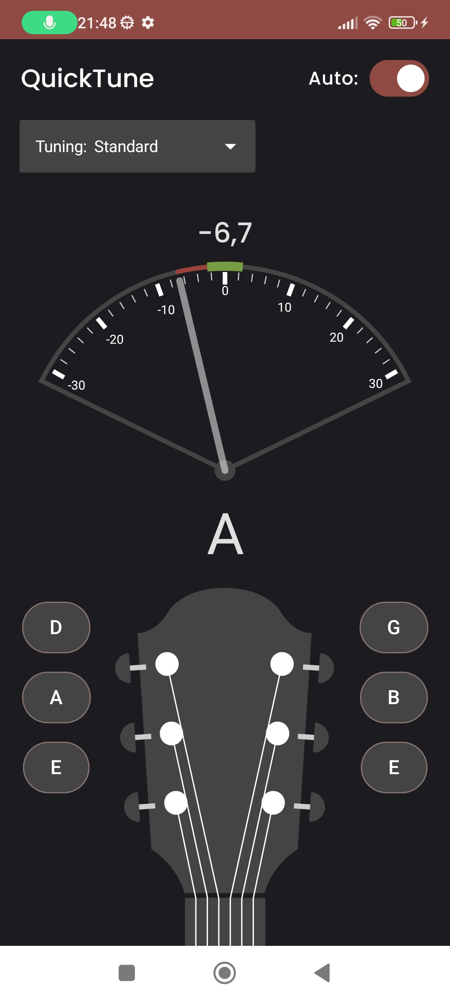
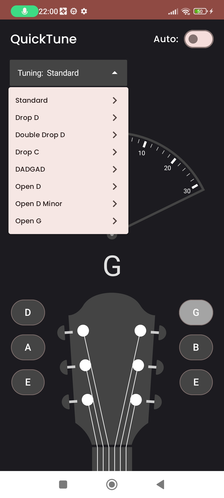

# QuickTune

Guitar tuner app for Android with support for different tunings.

## Screenshots

   

## Features

Listens as you play a string and indicates whether it is in-tune.
Displays the amount to tune each string up/down to reach the correct pitch.
Automatic detection of which string is playing.
Choose from 5+ common guitar tunings.
Support for multi-window and large screen devices.

## Installation

1. Find the latest release .
2. Download the `.apk` file onto your Android device.
3. Open the downloaded file and follow the prompts to install the app.
